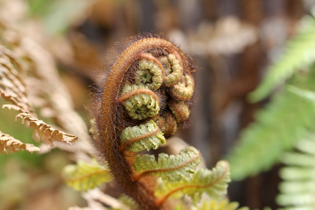

# Koru

## Description

Koru connects you to the Māori concept of growth and renewal, inviting daily reflections to foster gratitude and mindfulness.

Koru is a spiral shape that reflects the unfurling of a silver fern frond. It symbolizes new life, growth, strength, and peace—qualities that can be cultivated through the practice of gratitude.

Here's what it looks like:

## Why Koru?

Koru was inspired by my personal journey through difficult times. During this period, I discovered the transformative power of gratitude through books and my own journal, where I recorded three things I was grateful for each day.

This practice shifted my mindset, fostering positivity, hope, and happiness. I realized that gratitude is a powerful tool for enhancing our lives. My goal is to provide a space where individuals can connect with their own experiences, find joy in the small moments, and embrace the journey of growth and renewal. Together, we can harness the strength of gratitude to enhance our lives in meaningful ways.

## Features

I am currently planning on the following features:

<ul>
    <li>
        
<strong>User registration and login:</strong> Secure sign-up and authentication for personalized experiences.

    </li>
        <li>
        
<strong>Daily gratitude journal entries:</strong> Users can easily add and manage their daily reflections.

    </li>
        <li>
        
<strong>Search function:</strong> Review previous entries and identify patterns over time.

    </li>
        <li>
        
<strong>Fully responsive design:</strong> Seamless experience across all devices, from mobile to desktop.

    </li>
        <li>
        
<strong>Incorporation of UX best practices:</strong> Designed with user experience in mind for intuitive navigation.

    </li>
</ul>

*Additional features may be added in the future...*

## Tech Stack

    

        Front-End Technologies
    

    <ul>
        <li>
            
HTML

        </li>
        <li>
            
CSS

        </li>
        <li>
            
Tailwind CSS

        </li>
        <li>
            
Next.js

        </li>
        <li>
            
TypeScript

        </li>
        <li>
            
Firebase

        </li>
    </ul>

    

        Back-End Technologies
    

    <ul>
        <li>
            

                TypeScript
            

        </li>
        <li>
            

                Node.js
            

        </li>
        <li>
            

                Express.js
            

        </li>
        <li>
            

                Knex.js
            

        </li>
        <li>
            

                MySQL
            

        </li>
    </ul>

    

        Libraries/Tools
    

    <ul>
        <li>
            

                Material UI
            

        </li>
        <li>
            

                shadcn/ui
            

        </li>
    </ul>

## Future Improvements

To be added.

## Contact Information

I welcome constructive feedback from everyone—software engineers, UX/UI designers, and anyone interested in my work! Your insights are invaluable for my growth and the improvement of my projects.

Please feel free to reach out to me on <a href="https://github.com/lilymtle">GitHub</a> or <a href="https://linkedin.com/in/lilymtle">LinkedIn</a>. I also invite you to check out my other project I am working on, as well as my portfolio:

<ul>
    <li>
        <a href="https://lilyle.dev">Portfolio</a>
    </li>
    <li>
        <a href="https://mood-compass.vercel.app/">MoodCompass</a>, <a href="https://github.com/lilymtle/mood-compass">MoodCompass GitHub Repo</a>
</ul>

## Resources

Here is a list of gratitude books I have read and found impactful:

<ol>
    <li>
        <a href="https://www.amazon.ca/Power-Gratitude-thankful-happier-healthier/dp/1782494391">The Power of Gratitude: The Thankful Way to a Happier, Healthier You by Lois Blyth</a>
    </li>
    <li>
        <a href="https://www.amazon.ca/Gratitude-Diaries-Looking-Bright-Transform/dp/1101984147">The Gratitude Diaries: How a Year Looking on the Bright Side Can Transform Your Life by Janice Kaplan</a>
    </li>
    <li>
        <a href="https://www.amazon.ca/Power-Thank-You-Discover-Gratitude/dp/1546016120">The Power of Thank You: Discover the Joy of Gratitude by Joyce Meyer</a>
    </li>
    <li>
        <a href="https://www.amazon.ca/Thanks-Science-Gratitude-Make-Happier/dp/0618620192">Thanks!: How the New Science of Gratitude Can Make You Happier by Robert Emmons</a>    
</ol>

I also recommend the video **"An Experiement in Gratitude | The Science of Happiness** on YouTube, published by Participant. It's less than 8-minutes! You can watch it <a href="https://www.youtube.com/watch?v=oHv6vTKD6lg">here</a>.